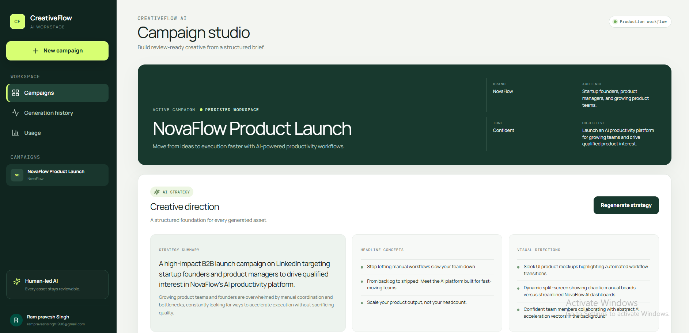
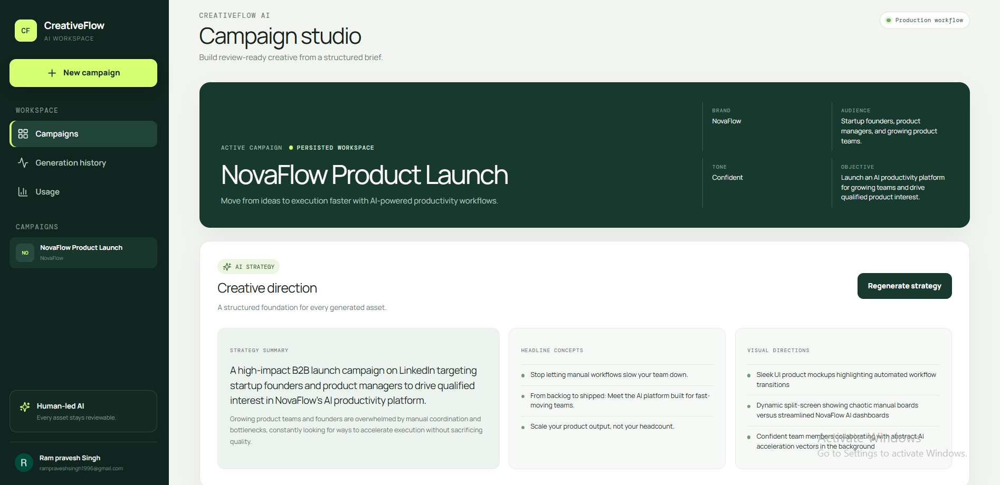
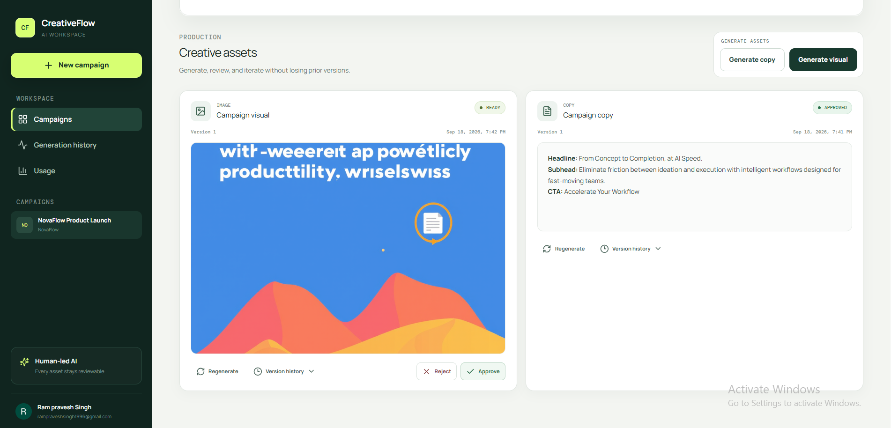
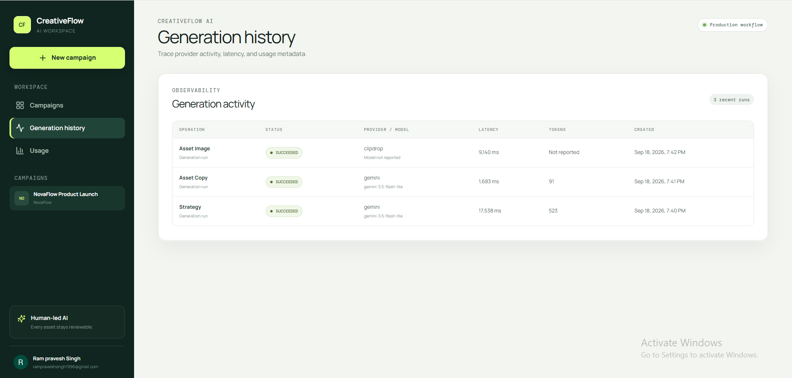
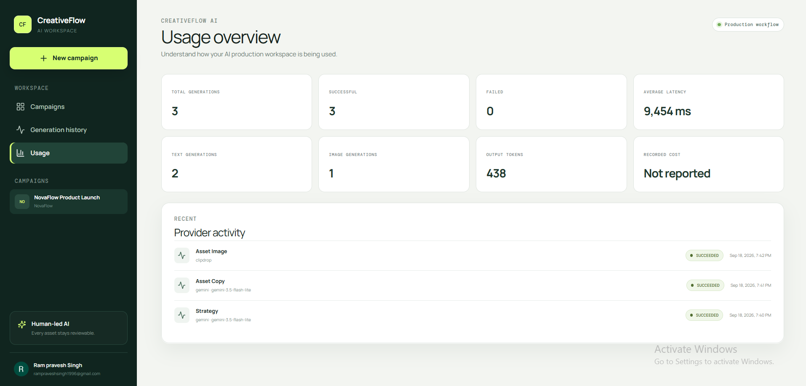
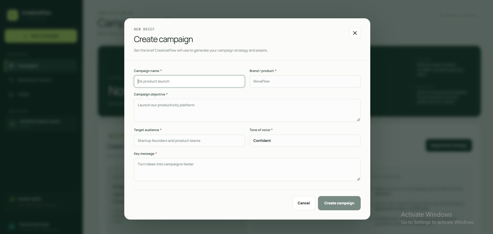

# CreativeFlow AI — AI Creative Production Workspace

Turn a campaign brief into a structured AI strategy, copy, visual assets, and a human-reviewed production record.

**Live demo:** [creativeflow-ai-ten.vercel.app](https://creativeflow-ai-ten.vercel.app)

CreativeFlow AI brings creative planning, multimodal generation, approval, asset versioning, and generation observability into one focused workflow. It is a production-deployed, full-stack application built around accountable AI-assisted creative work rather than one-off prompts.

## Key features

- Convert a creative brief into a structured campaign strategy.
- Generate campaign copy and visual assets in the same workspace.
- Keep people in control with explicit asset approval and rejection.
- Regenerate assets while retaining version history.
- Persist campaigns, strategies, assets, reviews, and generation runs in PostgreSQL.
- Inspect provider, model, latency, token, and cost metadata when available.
- Monitor aggregate usage and recent generation activity.
- Authenticate workspace access with Clerk.

## Product workflow

```text
Creative brief
  -> Structured AI strategy
  -> Copy + visual generation
  -> Human review / approval
  -> Versioned assets
  -> Generation history + usage observability
```

## Product tour

### Campaign workspace



### AI strategy



### Asset production and review



### Generation history



### Usage observability



### Create a campaign



## Architecture and stack

| Area | Technology |
| --- | --- |
| Frontend | React, TypeScript, Vite |
| Backend | Express, TypeScript |
| Data | PostgreSQL with raw SQL migrations |
| Authentication | Clerk |
| Validation | Zod |
| Structured generation | Gemini |
| Image generation | Clipdrop |
| Asset hosting | Cloudinary |

The repository contains two applications:

- `apps/web` — the Vite browser client and authenticated API consumer.
- `apps/api` — the Express API, validation, PostgreSQL persistence, provider integrations, and migrations.

## Engineering highlights

- Structured LLM outputs are validated before entering the persisted workflow.
- The API records each generation run with provider/model, timing, token, and cost fields when the provider supplies them.
- Human review status and asset versions make regenerated creative work traceable.
- Raw SQL migrations use a migration ledger, PostgreSQL advisory lock, transactional application, and bounded connection retry handling for repeatable deployments.
- The deployed system has been production-tested across sign-in, persistence, strategy/copy/visual generation, approval, refresh persistence, history, and usage views.

## Local development

Requires Node.js 22+, npm, Docker, and a Clerk development application.

1. Create local environment files from the examples:

   ```bash
   cp apps/api/.env.example apps/api/.env.local
   cp apps/web/.env.example apps/web/.env
   ```

2. Supply placeholder-backed development values only in your untracked local files:

   ```dotenv
   # apps/api/.env.local
   PORT=<PORT>
   NODE_ENV=<NODE_ENV>
   DATABASE_URL=<POSTGRES_CONNECTION_URL>
   CLERK_SECRET_KEY=<CLERK_SECRET_KEY>
   CLIENT_ORIGIN=<WEB_ORIGIN>
   GEMINI_API_KEY=<GEMINI_API_KEY>
   GEMINI_MODEL=<GEMINI_MODEL>
   CLIPDROP_API_KEY=<CLIPDROP_API_KEY>
   CLOUDINARY_CLOUD_NAME=<CLOUDINARY_CLOUD_NAME>
   CLOUDINARY_API_KEY=<CLOUDINARY_API_KEY>
   CLOUDINARY_API_SECRET=<CLOUDINARY_API_SECRET>
   AI_PROVIDER_MODE=<AI_PROVIDER_MODE>

   # apps/web/.env
   VITE_CLERK_PUBLISHABLE_KEY=<CLERK_PUBLISHABLE_KEY>
   VITE_API_URL=<API_BASE_URL>
   ```

3. Start PostgreSQL and the API:

   ```bash
   docker compose -f apps/api/docker-compose.yml up -d
   cd apps/api
   npm ci
   npm run migrate
   npm run dev
   ```

4. In another terminal, start the web app:

   ```bash
   cd apps/web
   npm ci
   npm run dev
   ```

## Quality checks

Run these in both `apps/api` and `apps/web`:

```bash
npm run lint
npm run typecheck
npm run test
npm run build
npm run format:check
```

The API test suite includes focused migration-runner coverage as well as health, provider, and database-dependent workflow tests.

## Deployment

- Frontend: [Vercel](https://creativeflow-ai-ten.vercel.app)
- Backend: Render web service
- Database: PostgreSQL

The Render build installs build-time dependencies, compiles the API, and runs idempotent migrations before starting the compiled Express server. The frontend is configured at build time with `VITE_API_URL` and communicates with the API under `/api/v1`.
